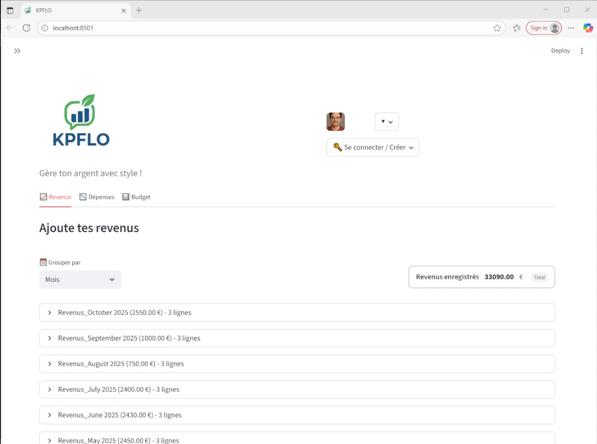
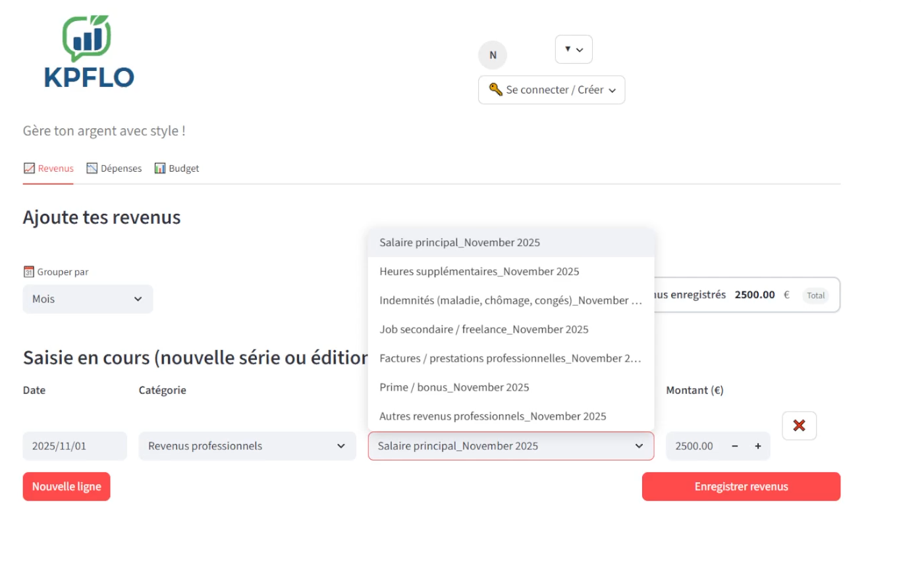
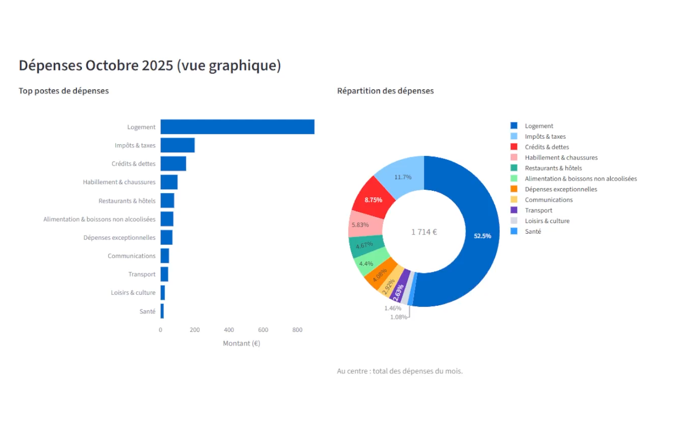
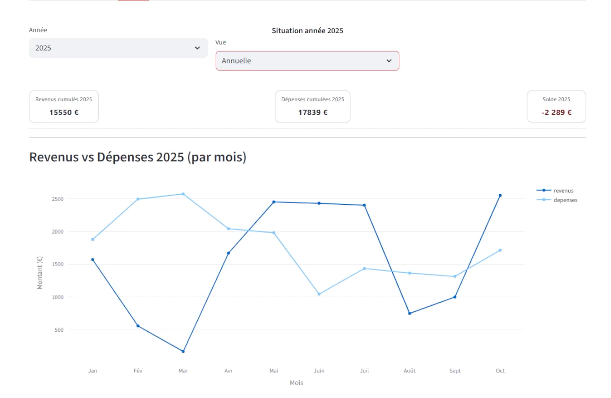
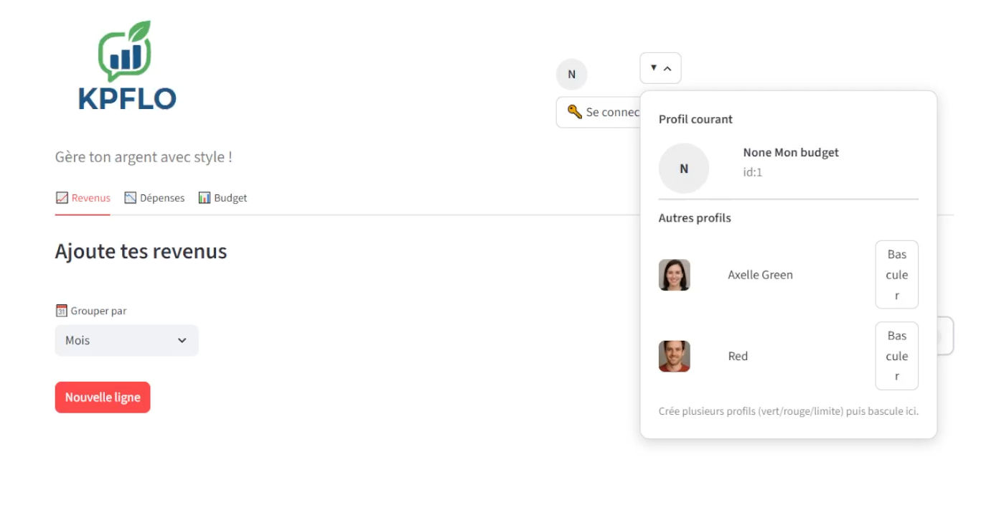
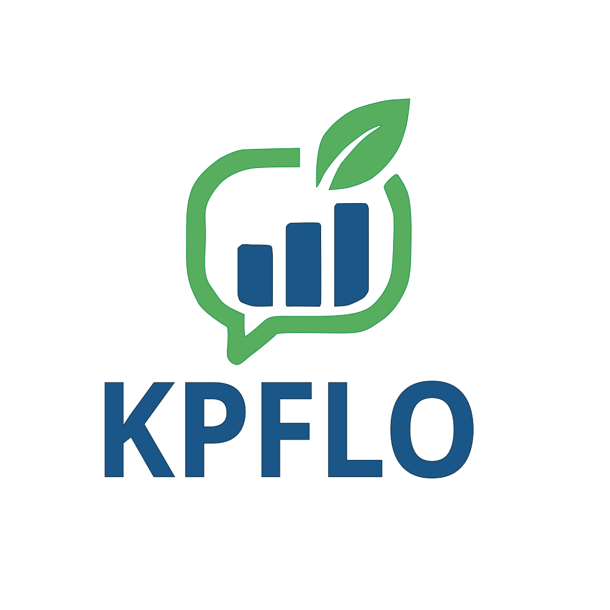

# KPFLO – Gestionnaire de budget intelligent

<p align="center">
  
</p>

**KPFLO** est un **tableau de bord interactif pour la gestion des finances personnelles et familiales**, développé en **Python** avec **Streamlit**.  
Il permet d’ajouter, modifier et analyser ses **revenus**, **dépenses** et **épargne** à travers une interface intuitive et dynamique.

> **3 onglets principaux :**  
>  **Revenus** – **Dépenses** – **Budget (ton coach financier)**

---

## ✨ Fonctionnalités principales

### 1. **Saisie ultra-fluide des Revenus & Dépenses** _(aucun profil requis)_



> **Tu démarres en 3 secondes** — sans inscription, sans CSV.

- **Un clic → une nouvelle ligne** (`+ Nouvelle ligne` ou `+ Nouvelle dépense`)
- **Date** : calendrier interactif instantané
- **Catégorie** :
  - **4 familles de revenus** (professionnels, financiers, sociaux, exceptionnels)
  - **23 catégories de dépenses** (inspirées de l’INSEE + modernes : streaming, cryptos, enfants, animaux, etc.)
- **Libellé** : suggestions intelligentes + suffixe automatique du mois  
  → `Salaire_Mars 2025`, `Course_Avril 2025`, `Livret A_Mai 2025`
- **Montant** : saisie rapide, validation immédiate
- **Enregistrer** : un seul bouton

> **Exemple** :  
> _Revenu → Revenus professionnels → Salaire → 2500 € → Enregistrer_ → **C’est fait.**

---

### 2. **Édition & suppression intuitive**

- Chaque ligne est **numérotée par mois**
- **Modifier** : clique sur le numéro → _"Charger pour édition"_ → modifie → enregistre
- **Supprimer** : même principe → confirmation → ligne effacée
- **Zéro perte de données** : tout est sauvegardé en **SQLite local**

---

### 3. **Tableau de bord Budget : ton coach financier personnel**

Accède à l’onglet **Budget** pour une **analyse complète, visuelle et interactive** de tes finances.

#### **Sélecteur de période** (en haut)

- **Vue Mensuelle** ou **Vue Annuelle** (bouton de bascule)
- **Sélecteur de mois** : remonte dans le temps (ex: `Mars 2023`, `Décembre 2024`)
- **Sélecteur d’année** : passe d’une année à l’autre (ex: `2023`, `2024`, `2025`)

> **Navigation fluide** dans tout ton historique — même avec 3 ans de données.

---

#### **Vue Mensuelle** (par défaut)



| Fonction                       | Description                                 |
| ------------------------------ | ------------------------------------------- |
| **Revenus / Dépenses / Solde** | Affichés en temps réel                      |
| **Graphique Donut**            | Répartition des **dépenses par catégorie**  |
| **Top 3 postes lourds**        | Alertes automatiques                        |
| **Règle 50/30/20**             | Indicateurs colorés (vert / orange / rouge) |
| **Projection fin de mois**     | « Si tu continues comme ça… »               |
| **Coach financier**            | Conseils personnalisés en langage naturel   |

---

#### **Vue Annuelle** (différente et puissante)



| Fonction                           | Description                                                                      |
| ---------------------------------- | -------------------------------------------------------------------------------- |
| **Graphique en courbe superposée** | **Revenus** et **Dépenses** sur **12 mois** → **un seul coup d’œil** pour voir : |
|                                    | - Si tu **gagnes plus que tu ne dépenses**                                       |
|                                    | - Où tu **économises bien**                                                      |
| **Règle 50/30/20 annuelle**        | Moyenne sur l’année                                                              |
| **Projection fin d’année**         | Estimation réaliste                                                              |
| **Coach annuel**                   | Bilan global + conseils stratégiques                                             |

---

> **Résultat** :  
> Tu **comprends ton budget en 1 seconde**

## 👥 Profils de test intégrés



Pour découvrir toutes les fonctionnalités sans rien saisir, **KPFLO inclut deux profils complets** stockés dans la base locale `data/kpflo.db`.

| Profil     | Contenu                    |
| ---------- | -------------------------- |
| **Alex**   | 2 ans de revenus, dépenses |
| **Axelle** | 3 ans de données complètes |

Les avatars se trouvent dans `data/avatars/2.png` et `data/avatars/3.png`.

### 🚀 Pour tester immédiatement :

1. Lance l’application (voir plus bas).
2. Clique sur le **sélecteur de profils** en haut de la page → choisis **Alex** ou **Axelle**.
3. Ouvre l’onglet **Budget** pour explorer :
   - le **donut mensuel**,
   - la **courbe annuelle revenus/dépenses**,
   - les **ratios 50/30/20**,
   - le **coach financier**.

> _Idéal pour les démonstrations : tout est déjà prêt à être visualisé !_

---

## 🖼️ Aperçu & identité



> **Slogan** : _« Gère ton argent avec style ! »_

- Interface **moderne, épurée et responsive**
- Avatar utilisateur (upload + recadrage auto)
- Mode **invité immédiat** : pas besoin de compte pour commencer

---

## 📦 Prérequis

- **Python 3.10+**
- `pip` ou `conda`

### Librairies Python principales

```txt
streamlit
pandas
numpy
plotly
python-dateutil
Pillow

⚙️ Installation
bash
Copier le code
# 1. Cloner le projet
git clone https://github.com/BANAIAS/KPFLO.git
cd kpflo

# 2. Créer un environnement virtuel
python -m venv .venv
source .venv/bin/activate        # Linux/Mac
# .venv\Scripts\activate         # Windows

# 3. Installer les dépendances
pip install -r requirements.txt
# ou :
pip install streamlit pandas numpy plotly python-dateutil Pillow

🚀 Utilisation
bash
Copier le code
streamlit run streamlit_app.py
Puis ouvre ton navigateur à l’adresse :
http://localhost:8501

🧭 Premiers pas (mode invité)
Clique sur + Nouvelle ligne dans Revenus

Ajoute : Salaire, 2500 €, Mars 2025 → Enregistrer

Va dans Dépenses → ajoute quelques achats

Ouvre Budget → découvre ton solde, tes ratios et ton coach

📊 Exemple de données (CSV)
csv
Copier le code
user_id,date,kind,category,label,amount
1,2025-03-05,revenu,Revenus professionnels,Salaire_Mars 2025,2500
1,2025-03-08,depense,Alimentation & boissons non alcoolisées,Course_Mars 2025,120.5
1,2025-03-10,epargne,Épargne & placements,Livret A_Mars 2025,100

🧱 Structure du projet
text
Copier le code
KPFLO/
├─ .venv/                           # Environnement virtuel (non requis dans le dépôt)
├─ csv/                             # Fichiers CSV import/export
├─ data/
│  ├─ kpflo.db                      # Base SQLite (profils Alex & Axelle)
│  └─ avatars/
│     ├─ 2.png                      # Avatar Alex
│     └─ 3.png                      # Avatar Axelle
├─ screenshots/                     # Captures d’écran pour le README
│  ├─ screenshot_main.png           # Vue d’ensemble de l’application
│  ├─ header_profils.png            # Sélecteur de profils utilisateurs
│  ├─ revenus.png                   # Exemple de saisie d’un revenu
│  ├─ budget_mensuel.png            # Vue Budget mensuel (donut + ratios)
│  └─ budget_annuel.png             # Vue Budget annuel (courbes)
├─ kpflo_core/
│  ├─ __init__.py
│  ├─ budget.py
│  ├─ categories.py
│  ├─ dataio.py
│  ├─ depenses.py
│  ├─ revenus.py
│  └─ storage_sqlite.py
├─ streamlit_app.py                 # Interface principale Streamlit
├─ logo_kpflo.svg                   # Logo principal
├─ logo_kpflo_icon.png              # Icône de page
├─ requirements.txt                 # Dépendances
└─ README.md

👨‍💻 Auteurs
Patrice BANAIAS , Constance KEITA
Étudiants en Data Analytics – Sorbonne Université
Projet réalisé dans le cadre du cours Python


🎯 Objectifs pédagogiques

Ce projet a été réalisé dans le cadre de notre apprentissage de Python.
Avec KPFLO, nous avons appris à structurer une application complète, à manipuler des données réelles, et à créer une interface claire et interactive avec Streamlit.

Pourquoi ce projet nous a marqués

Nous avons voulu concevoir une application simple mais réaliste, inspirée de nos propres difficultés à suivre nos finances au quotidien.
Ce projet nous a permis de progresser en logique Python, en structuration de code, et en visualisation de données.

📄 Licence
MIT License – Libre d’utilisation, de modification et de distribution.


💬 Prêt à reprendre le contrôle de tes finances ?
Lance KPFLO et transforme tes données en décisions 💡
```
